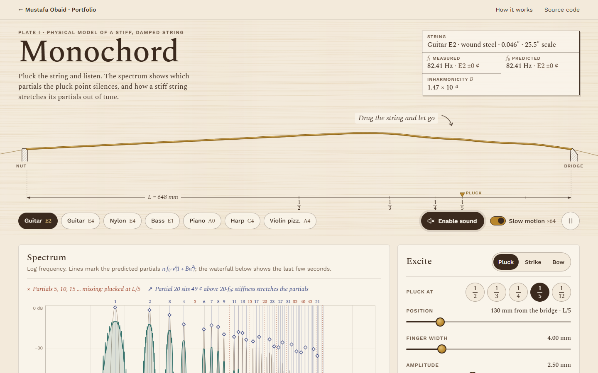

# Monochord — the physics of a vibrating string

Pluck, strike or bow a physically modelled string, hear it, watch it in slow motion, and see
which partials the excitation point removes and how stiffness stretches the rest.

**Live demo:** https://mustafaobaidd1.github.io/monochord-string-lab/



## The question

Why does a guitar sound brighter when you pluck near the bridge, and why do a piano's bass notes
sound slightly out of tune with themselves?

Both answers live in the spectrum of a vibrating string. Where you pluck decides how strongly each
partial is excited (and silences every partial with a node at the pluck point), and the bending
stiffness of a real string pushes its upper partials sharp of whole multiples of the
fundamental. This project simulates the string at the audio sample rate, plays the result, and
measures the sound against those two predictions while you listen.

## Features

- **A string you can pluck with your hands.** Drag it anywhere between nut and bridge and let go;
  the string takes the static shape a finger would give it, then rings. It is drawn as a luthier's
  plan (ruler with the ½, ⅓, ¼, ⅕ divisions, hatched nut and bridge, maple paper) and animated in
  slow motion (×4 to ×1024, chosen per note), in real time as a blur, or as a static vibration
  envelope under reduced motion.
- **Three excitations.** _Pluck_ (position, finger width, amplitude), _strike_ with a felt hammer
  (position, speed, mass, felt stiffness and exponent of the power-law contact) and _bow_
  (position, force, speed; press and hold to bow).
- **Live spectrum and waterfall** on one log-frequency axis, with the predicted partials
  n·f₀·√(1 + Bn²) as hairlines, their predicted levels as diamonds, and the missing partials marked
  and named ("Partials 3, 6, 9 … missing: plucked at L/3"). A waterfall shows high partials dying
  first.
- **Partials table:** measured frequency and level of the first 12 partials against theory, with
  the deviation in cents.
- **Seven presets** built from published string data: guitar E2 (wound) and E4 (plain), classical
  nylon, bass guitar E1, piano A0 (Yamaha G3 string, clearly inharmonic), harp C4, violin A
  (pizzicato and bowed).
- **Experiments:** "pluck at ½ ⅓ ¼ ⅕ 1/12" buttons, a stiffness slider for B (with a live chart of
  each partial's stretch, measured dots against theory bars), damping σ₀ and σ₁ with 60 dB decay
  times, and the output: force on the bridge or an electric-guitar pickup at any position (with
  its own comb).
- **A two-octave keyboard** (on screen and on the computer keyboard, one octave on phones) that
  retunes the string's tension to each note, T = μ(2Lf)², and shows when a note would need more
  tension than the string can take.
- **Honest limits:** every slider explains, at the end of its range, why it stops there (the
  scheme's stability bound, or the realism of the linear model), and warns when a tension exceeds
  the breaking load.
- **"How it works"** with the equations (KaTeX), the scheme, the validation table and the
  limitations, loaded on demand.

## How it works

### Model

The transverse displacement u(x, t) of a string of length L, tension T, linear density μ = ρA and
bending stiffness EI obeys the stiff, damped string equation (Bilbao 2009):

$$u_{tt} = c^2 u_{xx} - \kappa^2 u_{xxxx} - 2\sigma_0 u_t + 2\sigma_1 u_{txx},\qquad c=\sqrt{T/\mu},\ \kappa = \sqrt{EI/\mu}$$

with simply supported ends (u = u_xx = 0). SI units throughout: metres, newtons, seconds. The
material and the outer diameter d give μ = ρπd²/4 and EI = Eπd_c⁴/64, with d_c the load-bearing
core (the whole wire for plain strings; for wound strings, whose wrap adds mass but not
stiffness, 40 % of the diameter for the guitar strings, with the piano and bass presets setting
their own). Nylon stiffens under load: its bending modulus is taken as
E = 4.5 GPa + 39σ (σ the tensile stress), after Woodhouse & Lynch-Aird (2019).

Each mode sin(nπx/L) has

$$f_n = n f_0\sqrt{1+Bn^2},\qquad f_0=\frac{1}{2L}\sqrt{\frac{T}{\mu}},\qquad B=\frac{\pi^2 EI}{TL^2}=\frac{\pi^3 E d^4}{64\,TL^2}$$

and decays at σ_n = σ₀ + σ₁(nπ/L)². The presets fit σ₀ and σ₁ to two 60 dB decay times
(Bilbao's two-frequency formula).

**Pluck.** The string starts from rest in the shape it takes under the finger, found by solving
the scheme's own static equation (−Tδ_xx + EIδ_xxxx)u = f for a raised-cosine finger of width w
(two tridiagonal solves, since δ_xxxx = δ_xx² with these ends). For an ideal string and a point
pluck this is the triangle with modal amplitudes a_n ∝ sin(nπx₀/L)/n², zero for every partial with
a node at x₀. The bridge force T u_x − EI u_xxx weights partial n by Tβ_n(1 + Bn²), so the bridge
spectrum follows |sin(nπx₀/L)|/n: near the bridge the first L/2x₀ partials come out almost equally
strong, which is why that pluck sounds brighter. A magnetic pickup senses velocity,
ω_n a_n |sin(nπx_p/L)|.

**Strike.** A felt hammer of mass M meets the string with F = K[η]₊ᵖ (η the felt compression;
stiffness entered as Stulov's Q₀, the force at 1 mm). The collision uses the energy-conserving
discrete gradient F = (V(η⁺) − V(η⁻))/(η⁺ − η⁻), V = Kη^(p+1)/(p+1), solved per sample by
safeguarded Newton iteration on one monotone scalar equation.

**Bow.** The bow applies −Fφ(η) at x_B with Bilbao's friction curve
φ(η) = √(2a)·η·e^(−aη²+½), η the string velocity under the bow minus the bow speed, a = 1000 s²/m².
With η at the centred time difference, each sample needs one scalar equation, solved by Newton
iteration from the previous slip (so it follows the stick or slip branch) with a bisection
safeguard. In the playable range the string settles into Helmholtz motion. The force slider is
relative to a force found by simulation for each preset and scaled as Z₀^1.3·v_B for other
strings (Z₀ = √(Tμ); Schelleng's limits scale as Z₀² and Z₀).

### Numerical method

Explicit finite differences on a grid x_l = lh, t_n = nk, k = 1/f_s (one step per audio sample):

$$\delta_{tt}u = c^2\delta_{xx}u - \kappa^2\delta_{xxxx}u - 2\sigma_0\delta_{t\cdot}u + 2\sigma_1\delta_{t-}\delta_{xx}u$$

The backward difference in the σ₁ term keeps the update explicit (a five-point stencil in uⁿ and a
three-point stencil in uⁿ⁻¹). A von Neumann analysis of every mode gives the stability condition

$$h \ge h_{\min}=\sqrt{\tfrac12\left(c^2k^2+4\sigma_1k+\sqrt{(c^2k^2+4\sigma_1k)^2+16\kappa^2k^2}\right)}$$

and the grid uses N = ⌊L/h_min⌋ intervals (at most 640), as close to the bound as possible to
minimise numerical dispersion. The simulated partials follow the exact discrete relation
sin²(ωk/2) = λ²s² + 4ν²s⁴ (λ = ck/h, ν = κk/h², s = sin(nπ/2N)). Without loss the scheme conserves a
discrete energy exactly.

**From simulation to sound.** The scheme runs in an AudioWorklet. The output (bridge force or
pickup velocity) is normalised per string, high-passed at 4 Hz, then goes through a master volume
and a soft limiter. Without AudioWorklet the same code runs on the main thread and is scheduled as
short buffers; before the first tap it runs silently so the spectrum is alive anyway. The drawing
comes from a second copy of the same voice on a slower clock. The measurement window is the first
0.35–1.2 s after each excitation (after the attack for a bow), with a Blackman–Harris window,
zero-padding and quadratic interpolation of log-magnitude peaks; the fundamental is the lowest
prominent peak that heads a harmonic series, found without using any predicted frequency.

## Validation

This is an **educational simulation**, not a calibrated model of a particular instrument. What has
been validated is the numerics: the scheme reproduces the analytic results below. Numbers from
`npm run validate` at 48 kHz; the unit tests check the same targets.

| Check                                                     | Reference                                                                        | Result                                                                                                                    |
| --------------------------------------------------------- | -------------------------------------------------------------------------------- | ------------------------------------------------------------------------------------------------------------------------- |
| f₀ of a near-ideal string, 82.41 / 196 / 329.63 / 440 Hz  | (1/2L)√(T/μ)                                                                     | 82.4069 / 195.99996 / 329.62702 / 439.99876 Hz: within 0.005 ¢ (target ±2 ¢)                                              |
| Piano A0 (B = 2.09 × 10⁻⁴, N = 298), partials 1–10        | n·f₀·√(1+Bn²)                                                                    | within 0.72 ¢; the scheme's own dispersion relation within 0.0001 ¢; partial 10 stretched 17.2 ¢ (theory 17.9 ¢)          |
| Guitar E2 (B = 1.47 × 10⁻⁴, N = 174), partials 1–10       | n·f₀·√(1+Bn²)                                                                    | within 1.54 ¢ (dispersion relation within 0.0001 ¢)                                                                       |
| Bass E1 (B = 4.30 × 10⁻⁴, N = 203), partials 1–10         | n·f₀·√(1+Bn²)                                                                    | within 1.58 ¢ (dispersion relation within 0.0002 ¢)                                                                       |
| Pluck at L/3                                              | partials 3, 6, 9 ≥ 40 dB below neighbours                                        | 110.6, 119.0, 111.9 dB                                                                                                    |
| Lossless energy over 1 s, all presets                     | conserved                                                                        | max relative drift 7.3 × 10⁻¹³                                                                                            |
| Energy decay with σ₀ = 1.3 s⁻¹                            | e^(−2σ₀t)                                                                        | σ₀ recovered with relative error 6 × 10⁻⁸                                                                                 |
| Every preset for 2 s                                      | λ² + 4ν² + 4σ₁k/h² ≤ 1, bounded                                                  | 0.976–0.999; displacement never exceeds the pluck                                                                         |
| Hammer and string together, lossless                      | total energy conserved                                                           | max drift 7.4 × 10⁻¹³; rebound speed equals impact speed to 10⁻⁶                                                          |
| Hammer on a rigid target                                  | analytic power-law contact time                                                  | within 1 %                                                                                                                |
| Bowed violin A, nylon E4, steel E4 (bow at L/10, 0.1 m/s) | Helmholtz motion: exact harmonics, 1/n sawtooth, stick ≈ 1 − β, slip ≈ −v(1−β)/β | harmonics within 0.01 ¢; sawtooth within 0.3 dB (n = 2–6); stick 87–88 % (ideal 90 %); slip −1.0 to −1.2 m/s (ideal −0.9) |
| Bowed harp C4 / wound E2                                  | mode locking                                                                     | harmonics within 0.1 / 0.23 ¢                                                                                             |
| Measured partial levels after a pluck                     |                                                                                  | sin(nπx₀/L)                                                                                                               | /n  | within 0.5 dB (unit test, steel E4) |

The tolerance on the stiff-string partials is the scheme's **numerical dispersion**: the explicit
scheme lowers partial n by roughly (1 − λ²)(nπ/2N)²/6, about a cent at the 10th partial, growing as
n². The app shows it live: in the stretch chart the measured partials (dots) sit slightly below
the theory bars on short grids, with a note saying how far.

## Limitations

- Linear model: no tension modulation, so large plucks do not go sharp; no longitudinal or
  torsional waves, no phantom partials.
- One plane of vibration and rigid, simply supported ends: no bridge motion, no instrument body,
  no coupled unison strings, so no two-stage piano decay or beating. You hear the bare string.
- Losses are Bilbao's two-parameter σ₀ + σ₁β² fit to two decay times; the presets' decay times are
  plausible estimates (piano after Weinreich), not measurements of these instruments.
- Wound strings are a steel core plus an effective density; the bass core fraction (0.33) is an
  assumption.
- Numerical dispersion (quantified above) and a grid capped at 640 intervals, which removes the
  very highest partials of long, slack strings.
- The felt is a lossless power law (no hysteresis); the pickup is a point velocity sensor (no
  aperture, no electrical resonance).
- The bow is a point contact with a smooth friction curve (no rosin thermodynamics, bow width or
  torsion). Stiff strings lock only approximately (bass and piano partials stray 3–4 ¢ from exact
  harmonics), and above about the 1/β-th partial the simulated spectrum falls below the ideal
  sawtooth because the Helmholtz corner is rounded.
- Loudness is normalised per string, not an absolute sound level.

## Prior art

- **Falstad's Loaded String applet** and **PhET Wave on a String** animate waves on a string for
  teaching; they do not synthesise sound at audio rate or model stiffness, damping laws and pluck
  spectra quantitatively.
- **D. Russell's acoustics animations (Penn State)** show the Fourier make-up of a plucked string
  and the missing harmonics; they are pre-rendered illustrations, not a simulation you can play.
- **Karplus–Strong and digital-waveguide demos** on the web make convincing plucked tones cheaply,
  but by filtering a delay line rather than solving the string equation, so stiffness, pluck shape
  and partial frequencies are not physically parameterised.
- **Bilbao's NESS project** and commercial physical-modelling instruments such as **Pianoteq** go
  much further in physics and sound quality; they are research code or instruments rather than an
  explorable browser lab that checks itself against theory.

What this project adds is the combination: an audio-rate finite-difference stiff string with
damping, pluck, strike and bow excitations, and a live spectrum overlaid with the theoretical
partials, their predicted levels and the measured deviations, all in the browser.

## Tech stack and architecture

Vite 8 + TypeScript (strict, no framework), Canvas 2D, Web Audio AudioWorklet, KaTeX for the
equations, Vitest and Playwright (with axe) for tests.

- `src/physics/` — the shared model: materials, grid design, the scheme, pluck/hammer/bow
  excitations, closed-form theory, presets and the `Voice`. The same code runs in the AudioWorklet,
  the main-thread fallback, the slow-motion picture engine, the tests and the validation script.
- `src/audio/` — the AudioWorklet processor (bundled with `?worker&url` so it loads under the
  GitHub Pages base path), the synth with overlapping voices and a soft limiter, the sound engine
  (worklet / main-thread stream / silent) and the analyser.
- `src/dsp/` — FFT, windows, peak interpolation, fundamental and partial measurement.
- `src/ui/` — the string drawing, spectrum and waterfall, controls, keyboard, charts and the lazily
  loaded "How it works".
- `scripts/validate.ts` — the long validation, writing `src/ui/validation-results.json`.

## Run locally

```bash
npm install
npm run dev          # http://localhost:5308/monochord-string-lab/
npm test             # unit tests (Vitest)
npm run validate     # long validation, prints the table above
npm run build
npm run test:e2e     # Playwright, desktop and mobile, against the production preview
npm run check        # lint, typecheck, format, unit tests, build, E2E
npm run screenshots  # README screenshots and the social image (after a build)
```

Add `?audio=fallback` to the URL to force the main-thread audio path, or `?audio=off` to see the
behaviour without Web Audio.

## Accessibility notes

- Every control is a native input or button with a visible label; slider values are announced
  in words (`aria-valuetext`), and the ends of each range explain themselves in text.
- The string is keyboard operable (arrow keys move the pluck point, Enter or Space plucks), the
  keyboard plays from the computer keys, and Space plucks, strikes or (held) bows.
- Measurements are announced through a polite live region; the spectrum canvas carries a text
  summary and the partials are also in a real table. Missing partials are marked by shape (×) and
  text, not colour alone.
- Visible focus rings throughout, 44 px touch targets for primary controls, no horizontal scroll
  from 320 px up, contrast checked with axe (WCAG 2.2 AA) in the E2E suite.
- With `prefers-reduced-motion`, the string is not animated: it shows its vibration envelope, the
  slow-motion animation is off until you switch it on, and there is a pause button.

## Credits & licences

- Model and scheme: S. Bilbao, _Numerical Sound Synthesis_ (Wiley, 2009); stiff-string partials:
  H. Fletcher, JASA 36, 203 (1964); hammer: A. Chaigne & A. Askenfelt, JASA 95, 1112 (1994) and
  A. Stulov's felt fits as summarised in J. O. Smith, _Physical Audio Signal Processing_.
- String data: D'Addario tension chart (unit weights and tensions for PL010, NW046, XLB100, EJ45);
  M. Podlesak & A. R. Lee, JASA 83, 305 (1988) (piano A0); Bow Brand harp strings (C4 gut);
  measured guitar inharmonicity from I. Barbancho et al., IEEE TASLP 20 (2012); nylon and gut
  properties from J. Woodhouse & N. Lynch-Aird, Acta Acustica 105, 516 (2019).
- Plucked-string Fourier amplitudes: D. Russell, Acoustics and Vibration Animations (Penn State);
  spectral peak interpolation: J. O. Smith, _Spectral Audio Signal Processing_.
- Fonts: Spectral and Work Sans (SIL Open Font License), self-hosted via Fontsource.
- KaTeX (MIT licence).

## License

MIT — see [LICENSE](LICENSE).
